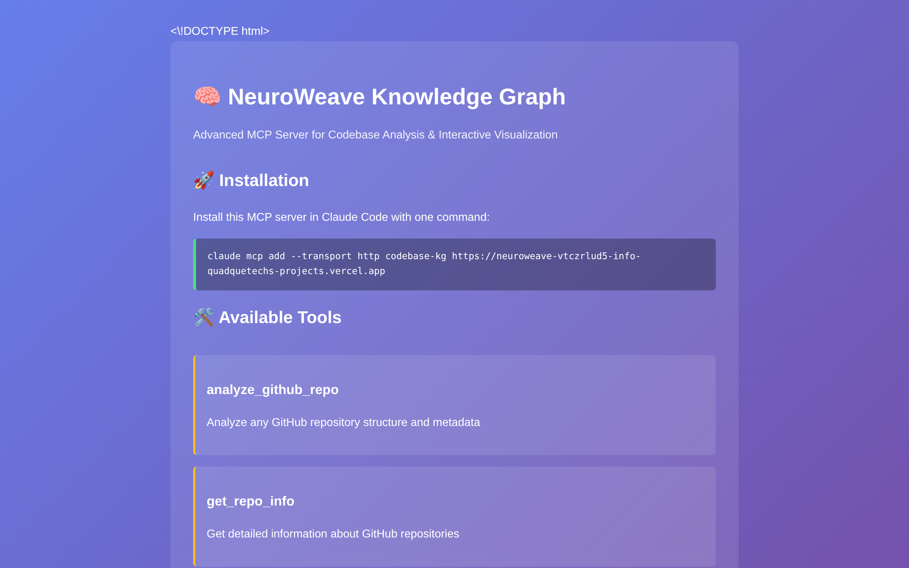
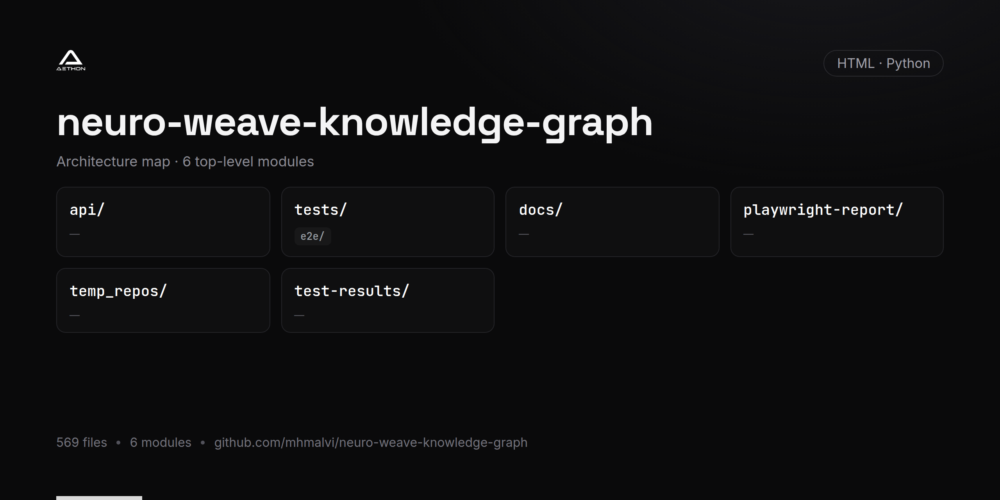

<!-- repo-card -->


> 🔗 **Live:** [neuroweave-mcp.vercel.app](https://neuroweave-mcp.vercel.app)



# 🧠 NeuroWeave Knowledge Graph
### *Advanced MCP Server for Codebase Analysis & Interactive Visualization*

A comprehensive Model Context Protocol (MCP) server that analyzes codebases and generates interactive knowledge graph visualizations for **Claude Code CLI**. Features multi-language support, neural-themed styling, and seamless GitHub integration.

> 🚀 **Ready for Claude Code CLI** - One-command setup for instant codebase analysis

## 🚀 Key Features

### 🔍 **Multi-Language Codebase Analysis**
- **Python**: Full AST parsing for classes, functions, imports
- **JavaScript/TypeScript**: Function and class detection, import analysis  
- **Java**: Class and method extraction, import mapping
- **C++, C#, Go, Rust**: Basic structural analysis

### 🎨 **Interactive Knowledge Graphs**
- **Neural-themed visualizations** with cyberpunk aesthetics
- **Force-directed layouts** with physics simulation
- **Real-time interaction** with zoom, pan, and hover details
- **Hierarchical relationships** between files, classes, functions

### 🌐 **GitHub Integration**
- **Repository cloning** and analysis
- **GitHub API integration** for metadata
- **Automatic updates** for existing repositories

### 📊 **MCP Server Tools**
- `analyze_codebase` - Local codebase analysis
- `analyze_github_repo` - GitHub repository analysis
- `generate_codebase_graph` - Interactive visualizations
- `get_repo_info` - Repository metadata extraction

## 🚀 Quick Start (Claude Code CLI)

### 🌐 **Remote Installation (Recommended)**

**One-command remote setup - no local installation needed:**
```bash
claude mcp add --transport http codebase-kg https://neuroweave-mcp.vercel.app
```

**Features:**
- ✅ **Zero setup** - works immediately
- ✅ **No dependencies** - runs on Vercel serverless  
- ✅ **GitHub analysis** - analyze any public repository
- ✅ **Always updated** - latest version automatically

### ⚡ **Local Installation (Full Features)**

**Windows:**
```cmd
git clone https://github.com/mhmalvi/neuro-weave-knowledge-graph.git
cd neuro-weave-knowledge-graph
install.bat
```

**Linux/Mac:**
```bash
git clone https://github.com/mhmalvi/neuro-weave-knowledge-graph.git
cd neuro-weave-knowledge-graph
chmod +x install.sh && ./install.sh
```

### 🎯 Instant Usage

After installation, just ask Claude Code:
- "**Analyze this codebase**"
- "**Create a knowledge graph for my project**"  
- "**Show me the structure of https://github.com/user/repo**"
- "**Generate a visualization of the dependencies**"

### 🔧 Manual Installation

1. **Clone & Setup:**
   ```bash
   git clone https://github.com/mhmalvi/neuro-weave-knowledge-graph.git
   cd neuro-weave-knowledge-graph
   ```

2. **Install Core Dependencies:**
   ```bash
   pip install -r requirements-mcp.txt
   ```

3. **Configure Environment:**
   ```bash
   cp .env.example .env
   # Edit .env and add your OpenAI API key
   ```

4. **Add to Claude Code:**
   ```bash
   claude mcp add codebase-knowledge-graph python ./mcp_server.py
   ```

### 📋 Requirements

- **Python 3.8+**
- **OpenAI API Key** (required for enhanced analysis)
- **GitHub Token** (optional, for better rate limits)

## 💡 Usage Examples

### 🔍 Codebase Analysis
```
👤 You: "Analyze this codebase and show me its structure"
🤖 Claude: [Analyzes current directory and generates knowledge graph]
```

### 🌐 GitHub Repository Analysis  
```
👤 You: "Create a knowledge graph for https://github.com/microsoft/vscode"
🤖 Claude: [Clones repo, analyzes structure, generates interactive visualization]
```

### 🎨 Custom Analysis
```
👤 You: "Show me all the classes and their relationships in this Python project"
🤖 Claude: [Generates focused visualization of class hierarchies]
```

## 📁 File Structure

```
├── mcp_server.py           # Core MCP server implementation
├── codebase_visualizer.py  # Specialized code visualization
├── generate_knowledge_graph.py # Text-based graph generation  
├── requirements-mcp.txt    # Minimal MCP dependencies
├── requirements-full.txt   # Full features (AI + Web UI)
├── install.sh / install.bat # Auto-installation scripts
├── .env.example           # Environment template
└── LICENSE               # MIT license
```

## 🎛️ Advanced Configuration

### Environment Variables
```bash
# Required
OPENAI_API_KEY=your_openai_api_key

# Optional  
GITHUB_TOKEN=your_github_token

# Streamlit (for web UI only)
STREAMLIT_SERVER_PORT=8501
```

### Dependency Options
- **Minimal MCP:** `pip install -r requirements-mcp.txt`
- **Full Featured:** `pip install -r requirements-full.txt`
- **Web UI Only:** `pip install streamlit && streamlit run app.py`

## 🌐 Deploy Your Own Remote MCP Server

### Deploy to Vercel (Free)

1. **Fork this repository**
2. **Deploy to Vercel:**
   ```bash
   npm install -g vercel
   vercel --prod
   ```
3. **Set environment variables in Vercel dashboard:**
   - `OPENAI_API_KEY` (optional)
   - `GITHUB_TOKEN` (optional)

4. **Use your deployment:**
   ```bash
   claude mcp add --transport http my-codebase-kg https://your-project.vercel.app
   ```

### Deploy to Other Platforms

- **Netlify:** Use `netlify-plugin-python`
- **Railway:** Direct Python deployment
- **Render:** Web service with Python runtime
- **DigitalOcean App Platform:** Python app

## 🎯 How It Works

### Web Interface Usage
1. **Input Selection**: Choose between file upload or direct text input
2. **Data Processing**: Upload code files or paste text directly
3. **Generate Visualization**: Click "Generate Knowledge Graph"
4. **Explore Results**: Navigate the interactive visualization:
   - **Drag nodes** to rearrange the layout
   - **Hover** for detailed information
   - **Zoom and pan** to explore different areas
   - **Filter** nodes by type or relationship

### MCP Tools Usage
Ask Claude to:
- "Analyze this codebase"
- "Create a knowledge graph for my project"  
- "Show me the structure of [GitHub repo URL]"
- "Generate a visualization of the dependencies"

## 🛠️ Architecture

The system uses:
1. **AST Parsing**: Extract structural information from source code
2. **Relationship Mapping**: Identify imports, inheritance, and dependencies
3. **Graph Generation**: Build interactive network visualizations
4. **MCP Integration**: Provide tools for AI assistant integration

## 👨‍💻 Author

**[mhmalvi](https://github.com/mhmalvi)**
- 🚀 Creator and maintainer of NeuroWeave Knowledge Graph
- 🧠 Developer of the MCP server implementation  
- 🎨 Designer of the neural-themed visualization system


NeuroWeave Knowledge Graph Codebase Analysis

  Architecture Overview

  Two Independent Systems:
  1. Streamlit Web Interface (app.py) - Standalone web application
  2. MCP Server (mcp_server.py) - AI assistant integration service

  Component Analysis

  🎨 Streamlit Frontend (app.py)

  State: Fully functional web application
  - Purpose: Interactive web interface for knowledge graph generation
  - Input Methods:
    - File upload (.txt files)
    - Direct text input via text area
  - Processing: Calls generate_knowledge_graph() from generate_knowledge_graph.py
  - Output: Interactive HTML visualization embedded using components.html()
  - Styling: Extensive cyberpunk/neural theme CSS with animations
  - Flow: User Input → Text Processing → LLM Graph Transform → PyVis Visualization        

  ⚡ MCP Server (mcp_server.py)

  State: Complete MCP protocol implementation
  - Purpose: Provides AI assistants (like Claude) with codebase analysis tools
  - Key Classes:
    - CodebaseAnalyzer - AST parsing for multiple languages
    - GitHubAnalyzer - Repository cloning and GitHub API integration
    - CodebaseVisualizer - Specialized code structure visualization
  - Tools Exposed:
    - analyze_codebase - Local directory analysis
    - analyze_github_repo - GitHub repo cloning + analysis
    - generate_codebase_graph - Interactive visualization generation
    - get_repo_info - GitHub API metadata retrieval

  🧠 Core Knowledge Graph Engine (generate_knowledge_graph.py)

  State: Text-to-graph transformation system
  - LLM Integration: Uses GPT-4o via LangChain for entity/relationship extraction
  - Async Processing: extract_graph_data() for LLM calls
  - Visualization: PyVis network with neural styling and physics simulation
  - Output: Enhanced HTML with custom CSS/JavaScript effects

  📊 Specialized Codebase Visualizer (codebase_visualizer.py)

  State: Code-specific graph generation
  - Node Types: Files, classes, functions, methods, imports, packages
  - Relationships: Contains, inherits, calls, imports, depends_on
  - Styling: Type-specific colors, shapes, and sizes
  - Physics: Force-directed layout with collision detection

  Data Flow Analysis

  Streamlit App Flow:

  User Input (text/file) → generate_knowledge_graph() → LLM Processing →
  PyVis Graph → Enhanced HTML → Streamlit Display

  MCP Server Flow:

  AI Assistant Request → MCP Tool Call → Codebase Analysis →
  Graph Generation → JSON Response → AI Assistant Processing

  Current State Assessment

  ✅ Working Components:
  - Streamlit web interface is fully functional
  - MCP server implements complete protocol
  - Multi-language code analysis (Python, JS, Java, etc.)
  - GitHub integration with cloning capability
  - Interactive visualizations with neural theming
  - Dual visualization modes (text-based vs code-structure)

  🔧 Configuration Requirements:
  - OpenAI API key for LLM processing
  - Optional GitHub token for repository access
  - Environment variables via .env file

  📦 Dependencies:
  - Core: langchain, streamlit, pyvis, mcp
  - Analysis: ast (Python), regex (other languages)
  - Integration: requests (GitHub API), subprocess (git)

  🚀 Deployment:
  - Web App: streamlit run app.py
  - MCP Server: Configured in Claude Desktop or via MCP client
  - Both systems operate independently

  The codebase represents a sophisticated knowledge graph system with dual interfaces     
   - a user-friendly web app and a powerful MCP server for AI integration.

## License

This project is licensed under the MIT License - a permissive open source license that allows for free use, modification, and distribution of the software.

For more details, see the [MIT License](https://opensource.org/licenses/MIT) documentation.
